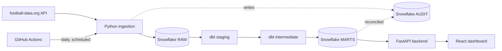

# Football Analytics Engineering Platform

An end-to-end analytics engineering platform that ingests, models, tests,
reconciles, and serves football competition data — built on the English
Premier League, architected to extend to additional leagues and
competitions without a redesign.

**Status: core platform functional and verified against real data.**
Ingestion, Snowflake, dbt, dimensional modelling, reconciliation, a React
dashboard, and CI/CD are all built and have each been run end-to-end
against a real Snowflake account and real football-data.org data — not
just written and assumed to work.

## Business Problem

Answer real questions about a competitive football league — how the table
is evolving, which teams over/underperform relative to expectation, how
teams split between home and away form, and how a title race or relegation
battle developed over a season — using a properly engineered data
platform, not a spreadsheet or a single API response rendered as-is.

## Architecture



Full detail, including why each layer is shaped the way it is, in
[docs/architecture.md](docs/architecture.md).

## Tech Stack

Python · Snowflake · dbt (Fusion) · SQL · FastAPI · React + TypeScript + Recharts · GitHub Actions

## Data Sources

Primary: [football-data.org](https://www.football-data.org/) (free tier).
**Real, tested limitation**: the free tier exposes only the last ~4
seasons of historical data (2023/24 onward), not the deeper history
initially assumed from third-party documentation — verified directly
against a real API key, not taken on faith. Full writeup, including what
was tried and what actually happened, in
[docs/data_sources.md](docs/data_sources.md) and
[ADR-001](docs/adr/ADR-001-data-source.md) / [ADR-002](docs/adr/ADR-002-historical-backfill.md).

## Pipeline

- **Ingestion** (`src/football_pipeline/`): rate-limited (10 req/min),
  retrying (`tenacity`, exponential backoff on 429/5xx/timeout), schema-
  validated API client; a Snowflake loader writing VARIANT payloads to RAW;
  a pipeline-run audit trail (`AUDIT.PIPELINE_RUN_AUDIT`).
- **Historical backfill**: `python -m football_pipeline --mode backfill --start-season 2023`.
  Idempotent — a season already successfully loaded is skipped unless
  `--force`. See [docs/incremental_strategy.md](docs/incremental_strategy.md)
  and [ADR-003](docs/adr/ADR-003-incremental-ingestion.md).
- **Daily incremental**: `python -m football_pipeline --mode daily`.
  Refreshes only the current season; completed historical seasons are
  never re-pulled.

## Snowflake Architecture

Single database `FOOTBALL_ANALYTICS`, five schemas (`RAW → STAGING →
INTERMEDIATE → MARTS`, plus `AUDIT`), one XSMALL warehouse with
`AUTO_SUSPEND=60`. Multi-league-ready via a `competition_code` column
rather than per-league schemas — adding a second competition is new rows,
not new infrastructure. Version-controlled DDL in `snowflake/`. Full
rationale in [ADR-004](docs/adr/ADR-004-snowflake-architecture.md).

**Authentication**: key-pair auth, not password — this account enforces
Duo MFA on password logins, which blocks any non-interactive caller (CI,
the dashboard API). Real problem, really hit, really fixed — see
[ADR-009](docs/adr/ADR-009-orchestration.md).

## dbt Architecture & Dimensional Model

Staging (dedup + type) → intermediate (home/away unpivot, standings
derivation) → marts (dimensional model + analytics). Fact grains, the ERD,
and the standings-derivation algorithm are documented in
[docs/data_model.md](docs/data_model.md). Materialization and the
`fact_match`/`fact_team_match` split are explained in
[ADR-005](docs/adr/ADR-005-dbt-materializations.md).

**League table derivation**: standings are independently *derived* from
match results via cumulative window functions — never copied from the
API's own standings endpoint. This is what makes reconciliation possible
at all. See [ADR-007](docs/adr/ADR-007-standings-derivation.md).

## Data Quality & Reconciliation

dbt tests (`not_null`, `unique`, `relationships`, `accepted_values`, custom
singular tests like "home team ≠ away team" and "winner agrees with
score") catch malformed data. Reconciliation catches a different class of
bug — a confidently-wrong transformation that still produces well-formed
rows: `fact_standing_snapshot` (derived) is checked against the API's own
reported table, three checks per team per season, results written to
`AUDIT.RECONCILIATION_AUDIT`. **Real result: 840 checks run, 0 mismatches**,
across all 4 ingested seasons. Full writeup, including the real join-key
bug this caught on its first run, in
[docs/reconciliation.md](docs/reconciliation.md).

## Analytics Marts

`mart_league_table`, `mart_league_progression`, `mart_team_form`,
`mart_home_away_performance`, `mart_goal_analysis` — each mapped to a real
grain, documented in [docs/data_model.md](docs/data_model.md). Metric
definitions (PPG, GD, clean sheet %, form, etc.) — and what was
deliberately *not* implemented and why (xG, points-from-losing-position,
shot-based metrics) — in [docs/metric_definitions.md](docs/metric_definitions.md).

## Dashboard

React + TypeScript + Recharts, served by a read-only FastAPI backend over
the Snowflake marts (`dashboards/api/`). Four pages:

- **Overview** — KPIs + full league table with crests and form pills
- **Progression** — interactive multi-team line chart of position by
  matchweek (verified against the real 2023/24 Man City vs. Arsenal title
  race)
- **Team Compare** — side-by-side stats for any two teams
- **Pipeline Health** — real `PIPELINE_RUN_AUDIT` history, including actual
  past failures, not a football-only page — the project's data-engineering
  differentiator

Why React over a conventional BI tool, and the refresh model, in
[ADR-010](docs/adr/ADR-010-react-dashboards.md).

## CI/CD & Automation

- **`.github/workflows/ci.yml`** — `ruff` + `pytest` (fully mocked, no live
  Snowflake) + `dbt parse` against a throwaway dummy profile, on every
  push/PR.
- **`.github/workflows/daily_pipeline.yml`** — scheduled daily (06:00 UTC)
  + manual trigger: ingestion → `dbt build` → reconciliation, authenticating
  via key-pair auth. **Verified with a real run**: ingestion, dbt build,
  and reconciliation all passed, with real data landing in Snowflake.

## Screenshots

The dashboard has been verified end-to-end in a live browser against real
Snowflake data (see commit history for details); static screenshots can be
added to `dashboards/screenshots/` — not yet included in this revision.

## Live Deployment

Backend on [Render](https://render.com) (free tier), frontend on
[Vercel](https://vercel.com) (free tier). See
[docs/deployment.md](docs/deployment.md) for the setup steps and
free-tier caveats (Render's free web services sleep after 15 minutes of
inactivity).

## Setup

```bash
git clone https://github.com/boseaditya1994/football-analytics-engineering-platform.git
cd football-analytics-engineering-platform
make setup                      # creates .venv, installs the package
cp .env.example .env            # fill in your own credentials — see below
```

### Environment Variables

See `.env.example`. You need:
- `FOOTBALL_DATA_API_KEY` — free at [football-data.org](https://www.football-data.org/client/register)
- `SNOWFLAKE_ACCOUNT`, `SNOWFLAKE_USER`
- `SNOWFLAKE_PRIVATE_KEY_PATH` (preferred — see `snowflake/README.md` for
  key-pair setup) or `SNOWFLAKE_PASSWORD` (interactive/local use only, will
  hit MFA on an MFA-enforced account)

### Running Locally

```bash
# Snowflake objects (one-time)
python snowflake/run_setup.py

# Historical backfill
make backfill START_SEASON=2023

# dbt build
cd dbt_football && dbt build

# Dashboard
uvicorn dashboards.api.main:app --reload --port 8000   # backend
cd dashboards/react && npm install && npm run dev       # frontend
```

See `Makefile` for all local developer commands.

## Cost Control

$0 to run: football-data.org free tier, Snowflake XSMALL warehouse with
`AUTO_SUSPEND=60`, GitHub Actions free minutes (public repo). No paid
service is used anywhere in this project.

## Limitations

Stated plainly, not buried:

- **4 seasons of historical data** (2023/24 onward) — a free-tier
  constraint, not a design choice. See [ADR-002](docs/adr/ADR-002-historical-backfill.md).
- **No player-level analytics** — the data source doesn't provide reliable
  player-level match stats on the free tier. See [ADR-006](docs/adr/ADR-006-dimensional-model.md).
- **No xG or shot-based metrics** — no free, continuous, multi-season
  source exists for the seasons this project covers. Never approximated.
- **No live/in-play data** — this is a daily-batch pipeline, described
  accurately as such, never as "real-time."
- **Single competition (Premier League)** — the schema is multi-league-ready
  (`competition_code` throughout), but only one competition is actually
  ingested today.

## Future Enhancements

Event-level/xG analytics (scoped, if ever added, per [ADR-001](docs/adr/ADR-001-data-source.md));
additional competitions; incremental dbt materializations if data volume
grows past what a full rebuild handles comfortably (see [ADR-005](docs/adr/ADR-005-dbt-materializations.md));
a Match Analysis dashboard page; mobile-responsive dashboard layout.

## Disclaimer

This is an independent portfolio/educational analytics engineering project
and is not affiliated with, endorsed by, or sponsored by the Premier
League, any other football competition, or their clubs. Data attribution
and usage are subject to the terms of the selected data provider(s).
