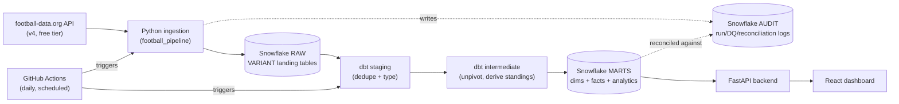

# Architecture

## Overview

## Layers

| Layer | Technology | Purpose |
|---|---|---|
| Ingestion | Python (`src/football_pipeline`) | Rate-limited, retrying API client; idempotent backfill/daily loaders |
| RAW | Snowflake, VARIANT tables | Untouched copy of every API payload, replayable |
| STAGING | dbt views | Dedupe (RAW is append-only across runs) + type/rename |
| INTERMEDIATE | dbt views | Reusable business logic: home/away unpivot, standings derivation |
| MARTS | dbt tables | Dimensional model (`dim_*`, `fact_*`) + analytics marts (`mart_*`) |
| AUDIT | Snowflake tables | `PIPELINE_RUN_AUDIT`, `DATA_QUALITY_AUDIT`, `RECONCILIATION_AUDIT` |
| Serving | FastAPI (`dashboards/api`) | Read-only REST layer over MARTS/AUDIT - keeps Snowflake credentials server-side |
| Presentation | React + Recharts (`dashboards/react`) | 4-page dashboard |
| Orchestration | GitHub Actions | CI on every push/PR; scheduled daily pipeline run |

## Why this shape

- **Single Snowflake database, layered schemas** rather than a database per layer - see [ADR-004](adr/ADR-004-snowflake-architecture.md).
- **Multi-league ready without schema sprawl**: every RAW and fact-adjacent table carries a `competition_code` (or joins to one), so a second competition is new rows, not new infrastructure.
- **RAW is append-only and immutable-by-design**: every ingestion run inserts new rows rather than updating in place. Staging is responsible for collapsing to "latest load per key." This trades a small amount of storage for a fully replayable audit trail of exactly what the API returned and when.
- **Two fact tables at match grain** (`fact_match`, `fact_team_match`) rather than one - see [ADR-005](adr/ADR-005-dbt-materializations.md).
- **Standings are derived, not copied** from the API - see [ADR-007](adr/ADR-007-standings-derivation.md) and [docs/reconciliation.md](reconciliation.md).
- **Key-pair Snowflake auth, not password** - required for any non-interactive caller (CI, the dashboard API) on an MFA-enforced account. See [ADR-009](adr/ADR-009-orchestration.md).

## Real, measured scope (as of this writing)

- 1 competition: English Premier League
- 4 seasons ingested: 2023/24 - 2026/27 (the free tier's actual limit - see [docs/data_sources.md](data_sources.md))
- 27 distinct teams across those seasons (promotion/relegation), 1,520 distinct matches
- 18 dbt models, 65 dbt tests, all passing
- 38 Python unit tests, all mocked (no live calls in the test suite)
- 840 reconciliation checks run against real data, 0 mismatches
