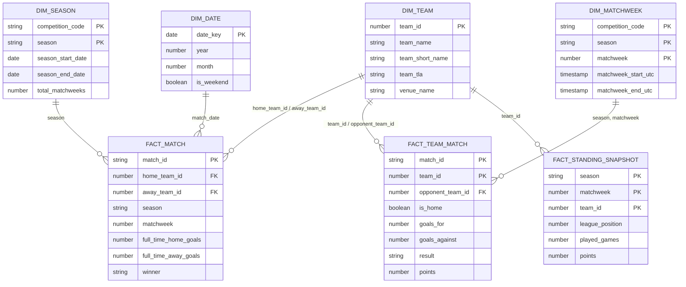

# Dimensional Model

## ERD

## Fact grain documentation

### `fact_match`

- **Grain**: one row per match.
- **Unique key**: `match_id`.
- **Foreign keys**: `home_team_id`, `away_team_id` → `dim_team.team_id`; `(competition_code, season, matchweek)` → `dim_matchweek`.
- **Measures**: `full_time_home_goals`, `full_time_away_goals`, `total_goals`, `goal_difference_home_minus_away`.
- **Why it exists**: some questions are naturally match-centric (final score, total goals in a fixture) where forcing a home/away unpivot would just require re-joining two rows back together.

### `fact_team_match`

- **Grain**: one row per team per match (home/away normalized).
- **Unique key**: `(match_id, team_id)`.
- **Foreign keys**: `team_id`, `opponent_team_id` → `dim_team.team_id`.
- **Measures**: `goals_for`, `goals_against`, `goal_difference`, `points`.
- **Why it exists**: this is the workhorse for team-centric analytics (points, form, home/away splits, rankings). Without it, every team-level query would need a `CASE WHEN home_team_id = :team THEN ... ELSE ...` - seen in [ADR-005](adr/ADR-005-dbt-materializations.md).

### `fact_standing_snapshot`

- **Grain**: one row per `(season, matchweek, team)` - the league table as it stood after that round.
- **Unique key**: `(season, matchweek, team_id)`.
- **Foreign keys**: `team_id` → `dim_team.team_id`; `(season, matchweek)` → `dim_matchweek`.
- **Measures**: `played_games`, `won`, `drawn`, `lost`, `goals_for`, `goals_against`, `goal_difference`, `points`, `league_position`.
- **Source**: independently derived from `fact_team_match` via cumulative window functions - **not** copied from the API's standings endpoint. See [docs/reconciliation.md](reconciliation.md) for why, and the algorithm.

## Standings derivation algorithm

Implemented in `dbt_football/models/intermediate/int_table_progression.sql`:

1. Order each team's matches chronologically by kickoff date.
2. Compute running totals (played/won/drawn/lost/goals/points) via
   `SUM(...) OVER (PARTITION BY team, season ORDER BY kickoff_utc ROWS UNBOUNDED PRECEDING)`.
3. Rank position within `(season, matchweek)` - the round number carried on the match itself - using the standard tie-break: points desc, goal difference desc, goals for desc (same order football-data.org's own table uses).

**Known simplification**: position is compared "as of matchweek N," which assumes every team has played its matchweek-N fixture by the time positions are ranked. Postponed/rearranged matches can briefly violate this. Acceptable for this project's scope; called out here rather than silently glossed over.

## Analytics marts

Built on top of the dimensional model, one grain each:

| Mart | Grain | Purpose |
|---|---|---|
| `mart_league_table` | team × season | Current standings + recent form |
| `mart_league_progression` | team × season × matchweek | Full-season position/points history with deltas |
| `mart_team_form` | team × match | Rolling last-5/last-10 PPG, goals, form string |
| `mart_home_away_performance` | team × season | Home vs. away split |
| `mart_goal_analysis` | team × season | Scoring/conceding profile, clean sheets |
